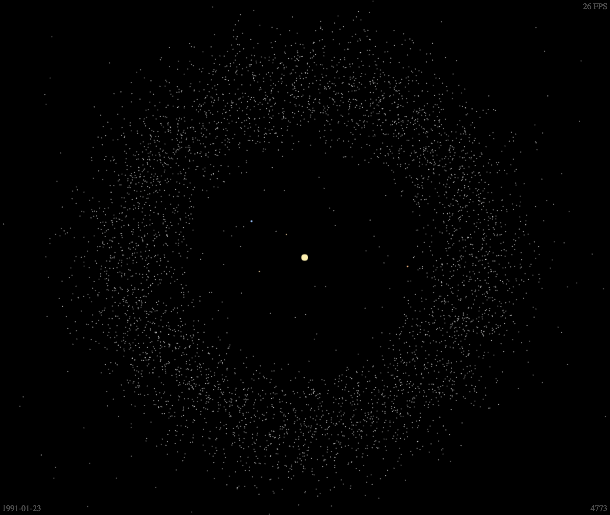

# Orrery

[Visualization](https://sn3p.github.io/Orrery) showing the orbits of [minor planets](https://en.wikipedia.org/wiki/Minor_planet) and their discovery over time.



The data we use is maintained by [The Minor Planet Center (MPC)](https://minorplanetcenter.net/). We use two separate datasets (which are updated daily) to extract the orbital elements and discovery circumstances of minor planets:

- [The MPC Orbit (MPCORB) Database](https://minorplanetcenter.net/iau/MPCORB.html) Database containing orbital elements of minor planets.

- [NumberedMPs.txt](http://www.minorplanetcenter.net/iau/lists/NumberedMPs.txt) Discovery circumstances of the minor planets.

## How to start

Install dependencies using `npm install`.  
Start server using `npm run start`.  
Build and bundle using `npm run build`.  
Watch changes and rebuild using `npm run watch`.

## Get updated data

Data files are stored in the `data` directory.
You can either download the data files manually using the links above, or use the download script:

Download the data and parse it to JSON:

```bash
cd data
./download_data.sh && ./data_to_json.py
```

There are over 500k results, so the output JSON file will be rather large and will be heavy to render. You can limit the maximum amount of results by passing a number as an argument:

```bash
./data_to_json.py 9999
```
