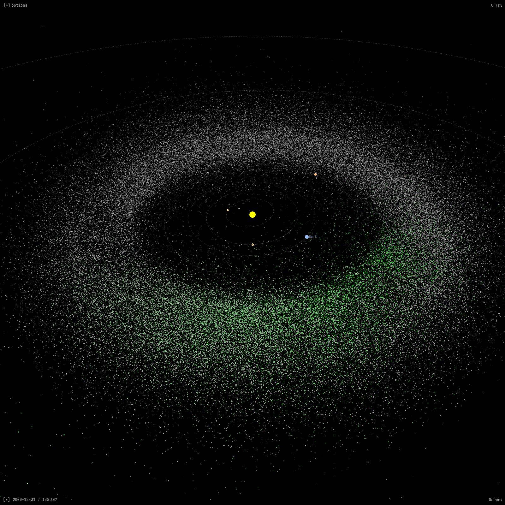

# Orrery

[Orrery](https://sn3p.github.io/Orrery) is an animated view of the Solar System's
[minor planets](https://en.wikipedia.org/wiki/Minor_planet), shown in the order they
were discovered. Each dot is an asteroid on its orbit; new discoveries appear green,
then fade to grey as the date advances. One app offers a
[2D](https://sn3p.github.io/Orrery) (Pixi.js) and a
[3D](https://sn3p.github.io/Orrery/?renderer=three) (Three.js) renderer; switch in
the options panel.

| [2D](https://sn3p.github.io/Orrery) (Pixi.js) | [3D](https://sn3p.github.io/Orrery/?renderer=three) (Three.js) |
|---|---|
|  |  |

## How to use

Open `[+] options` (top left) for playback speed, renderer and rendering resolution.
Speed 0 pauses, negative values reverse, and speed 1 advances 60 days per second.
Scroll to zoom; in 3D, drag to orbit the camera. The date and discovery count sit at
the bottom left, and **About** in the footer reopens the introduction.

## Development

Use Node.js 24.15 or later (see `.tool-versions`), then:

```bash
npm ci               # install
npm run serve        # dev server on port 3000 (or CONDUCTOR_PORT)
npm run build        # production build in dist/
npx playwright install chrome firefox webkit
npm run test:pr      # everyday checks
npm test             # complete regression matrix
```

See [development](docs/development.md) for setup details, test scopes, Conductor
and the pull request template.

## Data

Orbital elements and discovery circumstances come from
[The Minor Planet Center (MPC)](https://minorplanetcenter.net/): the
[MPCORB database](https://minorplanetcenter.net/iau/MPCORB.html) and
[NumberedMPs.txt](https://minorplanetcenter.net/iau/lists/NumberedMPs.txt). Only
numbered minor planets with a known discovery date are included, and orbits are
drawn as fixed ellipses from those elements, so positions are approximate.

The app loads the catalogue published by [orrery-data](https://github.com/sn3p/orrery-data).
Tests use an immutable [historical 100k fixture](tests/fixtures/historical100k/README.md)
that is never deployed.

## Documentation

- [Rendering and options](docs/rendering.md): playback clock, GPU asteroid
  rendering, resolution, benchmarks and measurements.
- [Catalogue loading](docs/catalog-loading.md): chunked delivery, buffering and
  configured sources.
- [Three adapter](docs/three-renderer.md) and [unification blueprint](docs/unification.md).
- [Browser tests](docs/browser-tests.md): scopes, groups and CI budget.
- [Deployment](docs/deployment.md) and [release/rollback](docs/promotion.md):
  GitHub Pages publishes `master` after checks pass.
