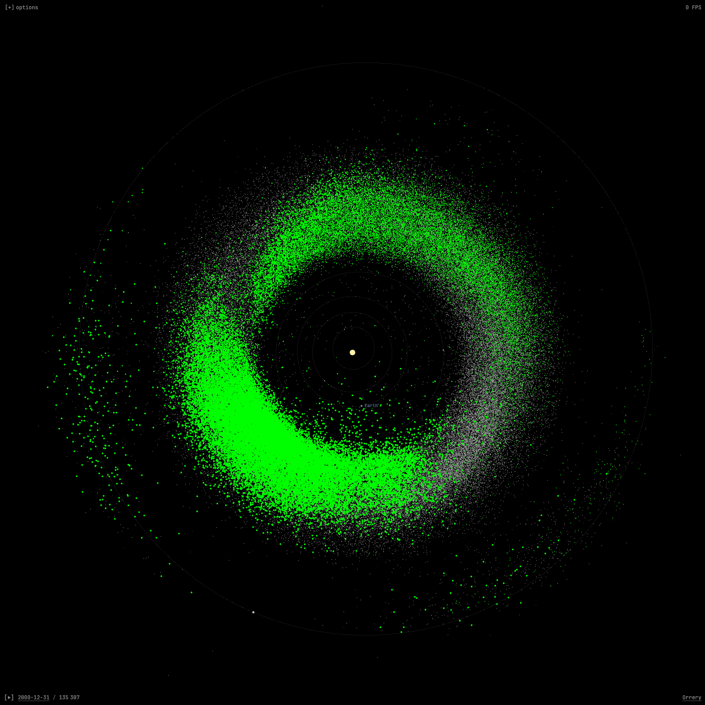

# Orrery

**Also check out [Orrery3D](https://github.com/sn3p/Orrery3D) ✨**

[Visualization](https://sn3p.github.io/Orrery) showing the orbits of [minor planets](https://en.wikipedia.org/wiki/Minor_planet) and their discovery over time.

Two datasets are used to extract the orbital elements and discovery circumstances of minor planets. The data used is maintained by [The Minor Planet Center (MPC)](https://minorplanetcenter.net/):

- [The MPC Orbit (MPCORB) Database](https://minorplanetcenter.net/iau/MPCORB.html) Database containing orbital elements of minor planets.
- [NumberedMPs.txt](https://minorplanetcenter.net/iau/lists/NumberedMPs.txt) Discovery circumstances of numbered minor planets.

## How to use

Use Node.js 24.15.0 or later in the 24.x release line (recommended),
22.22.3 or later in the 22.x release line, or 26.0.0 or later.

Install dependencies:

```bash
npm install
```

Start server:

```bash
npm run serve
```

Build and bundle:

```bash
npm run build
```

Watch changes and rebuild:

```bash
npm run watch
```

Deploy to gh-pages:

```bash
npm run deploy
```

### Conductor

Setup installs the locked dependencies with `npm ci`. When asdf is installed,
it adds the Node.js plugin if needed and installs the version pinned in `.tool-versions`.
Run starts the development server on the workspace's assigned port; use Open
to view the app. Each workspace can run its own server concurrently.

Test the setup script with Python 3.11 or later:

```bash
python3 -m unittest discover -s tests -v
```

## Get updated data

Data files are stored in the `data` directory.
You can either download the data files manually using the links above, or use the download script:

Download the data and parse it to JSON:

```bash
cd data
./download_data.sh && ./data_to_json.py
```

The bundled `data/catalog.json` contains **100,000 objects**. Running the importer without a limit replaces it with all numbered minor planets that have matching discovery dates.

On **12 September 2026**, a full import of fresh MPC data produced **895,910 objects** from **1,563,495 orbital records**. Unnumbered objects lack matching discovery records in `NumberedMPs.txt` and are excluded. These counts change as MPC updates its datasets; see [issue #47](https://github.com/sn3p/Orrery/issues/47) for the verified counts and upstream limitation.

A full export produces a large JSON file and is expensive to render. You can limit the maximum number of results by passing a number as an argument:

```bash
./data_to_json.py 9999
```

The limit selects the first matching objects in MPCORB order, then sorts them by discovery date. It does not sample across the full discovery timeline.

## Screenshot


